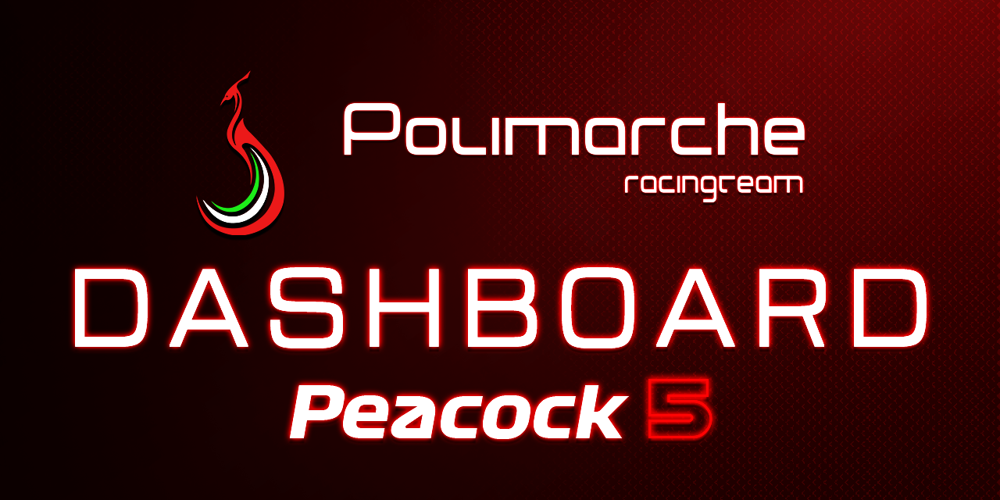

# 🏎️ Peacock Elettrica - Steering Wheel Dashboard Firmware

   


<p align="center">
  
</p>

> 🌐 **Language / Lingua:** 🇬🇧 **English**
> 
> 📖 Firmware and UI assets for the steering wheel display of the **Peacock Elettrica** Formula Student race car, developed by **[Polimarche Racing Team](https://www.polimarcheracingteam.com/it/)**.

---

This repository contains the bare-metal C firmware and the graphical assets for the custom steering wheel dashboard. The system acquires high-speed telemetry from the vehicle's CAN bus and drives a graphical HMI display in real-time, providing the driver with critical dynamic parameters, active vehicle states, and safety diagnostics.

**Hardware Stack:**
* **MCU:** STM32 Nucleo-F303K8T6 (ARM Cortex-M4)
* **Display:** Nextion NX4832T035 (3.5" HMI)
* **Transceiver:** MCP2551 (CAN Bus)

---

## 📌 Overview & Architecture

The firmware is designed for ultra-low latency and absolute stability during race conditions. It implements a custom scheduler handling specific tasks (Input reading, CAN transmission, Display updating) and relies heavily on hardware-level optimizations:

* **Non-Blocking UART via DMA:** Display commands are buffered and transmitted via Direct Memory Access, freeing the CPU for continuous CAN parsing.
* **Graphics Edge-Detection:** To prevent UART bottlenecking, the display task implements state-tracking. UI elements (colors, icons, backgrounds) are only transmitted when a state change occurs, not at every cycle.
* **Safety Latching:** Critical errors are latched on screen for a minimum safety time (2000ms) to ensure visibility even during sensor fluctuations.

---

## 📊 Parameters Displayed

The dashboard UI dynamically adapts to the car's state.

* 🏎️ **Vehicle Dynamics:** Real-time Car Speed, Wheel Speeds, and dual Steering Angle Sensor (SAS) progress bars.
* 🔋 **Powertrain:** State of Charge (SoC) progress bar, LV Battery Voltage, and Max Discharge/Regen currents.
* ♨️ **Thermals:** Average and Max temperatures for Inverters, Motors, Battery Pack, and Coolant. *Values turn red if they exceed safety thresholds.*
* ⚙️ **Engine Map (E-MAP):** Dynamic UI themes based on the active map:
    * 🟢 **ECO** (Green Theme)
    * 🔵 **NORMAL** (Blue Theme)
    * 🔴 **GAS** (Red Theme)
* ⚠️ **Diagnostics:** Real-time error matrix parsing. Displays specific proprietary Inveter Fault codes (e.g., `L2319`) or internal BMS/PDM error IDs.
* ✅ **State Machines:** R2D (Ready to Drive) and SDC (Shutdown Circuit) visual status indicators.

---

## 🖼️ Dashboard Preview

The UI relies on a `crop_image` technique to ensure seamless transitions between Engine Maps without reloading entire graphical pages, saving processing power on the Nextion internal chip.

<p align="center">
  
</p>

*The image shows the different graphic layouts and color schemes adapting to the selected Engine Map (ECO, NORM, GAS).*

---

## 🗂️ Project Structure

The repository is organized to separate UI assets from the embedded logic:

```text
dashboard-peacockElettrica/
├── README.md
├── elements_display.txt                # Nextion variable mapping reference
├── error_codes.txt                     # Diagnostic error ID reference
│
├── dashboard-layout/                   # Nextion Editor UI Assets
│   └── font/                           # Custom generated Michroma fonts
│
├── documents/                          # Project specifications and manuals
│   ├── Specifica_Pulsanti_Volante.docx
│   └── Dashboard_DISPLAY_v2.docx
│
└── dashboard-stm32/                    # STM32CubeIDE Project
    ├── dashboard-peacockElettrica.ioc  # CubeMX Configuration
    ├── STM32F303K8TX_FLASH.ld          # Linker Script
    └── Core/
        ├── Inc/                        # Headers (.h)
        │   ├── car_data.h              # Main telemetry struct & Error Enums
        │   ├── Scheduler.h
        │   ├── Tasks.h
        │   └── Communication/
        │       ├── can.h
        │       └── serial.h
        └── Src/                        # Source Code (.c)
            ├── main.c
            ├── Scheduler.c
            ├── shift_register.c        # Custom bit-banging shift register logic
            ├── Tasks/                  # Application Logic
            │   ├── task_can.c
            │   ├── task_display.c      # Dynamic UI rendering logic
            │   ├── task_errors.c
            │   └── task_inputs.c
            └── Communication/
                ├── can.c               # CAN Filter and RX/TX logic
                └── serial.c            # DMA UART Nextion wrappers

```
---
## ⚠️ Diagnostic Error Codes

The dashboard features a dedicated error matrix that parses CAN messages and displays specific fault IDs to the driver and trackside engineers. Errors are evaluated by priority and latched on the screen for a minimum safety time.

### ⚡ Inverter Proprietary Faults (Special Behavior)
If a critical hardware fault occurs within the inverters (Codes `310` and `311`), the dashboard **does not** display a standard numeric ID. Instead, it parses the proprietary error sub-code directly from the inverter CAN frame and displays it with a directional prefix:
* **`L[code]`** : Left Inverter Fault (e.g., `L2319`)
* **`R[code]`** : Right Inverter Fault (e.g., `R3587`)

### 🔢 Standard Error IDs
For all other systems, the dashboard displays a numeric ID based on the following subsystems:

**System & Timeouts (1 - 99)**
* `1` - BMS Timeout (> 3000ms)
* `2` - MCU Timeout (> 3000ms)
* `3` - PDM VCU1 Timeout (> 3000ms)
* `4` - PDM VCU2 Timeout (> 3000ms)
* `99` - Shift Register (Manettino) Hardware Error

**CAN Bus Connectivity (100 - 199)**
* `100` - CAN Filter Init Error
* `101` - CAN TX Error
* `102` - CAN RX Error
* `103` - CAN Bus-Off

**BMS - Battery Management System (200 - 299)**
* `201 to 206` - Module [1 to 6] Overvoltage *(Base 201 + Module Index)*
* `211 to 216` - Module [1 to 6] Undervoltage *(Base 211 + Module Index)*
* `221 to 226` - Module [1 to 6] Overtemperature *(Base 221 + Module Index)*
* `207` - Pack Overcurrent
* `208` - Pack Overvoltage
* `209` - Cell Open Wire
* `210` - Temperature Sensor Open Wire
* `217` - Current Sensor Disconnected
* `218` - Slave Sensor Disconnected

**MCU & Pedals (300 - 399)**
* `300` - Left Inverter (INV1) Derating
* `301` - Right Inverter (INV2) Derating
* `302` - APPS Implausibility (Accelerator Pedal)
* `303` - APP 1 Out of Range
* `304` - APP 2 Out of Range
* `305` - SAS (Steering Angle Sensor) Out of Range

**PDM VCU1 - Power Distribution & Cooling (400 - 499)**
* `400 to 403` - Overcurrent on R1 / R2 / R3 / R4
* `404` - Negative Current Error
* `405` - 24V Range Error
* `406` - Low Battery Voltage (LV)
* `407` - DC-DC Temperature Error
* `408` - Overcurrent 24V Rail
* `409` - Overcurrent TSAC Fans
* `410` - Overcurrent Radiator Fans (Left)
* `411` - Overcurrent Radiator Fans (Right)
* `412` - Overcurrent Cooling Pump

**PDM VCU2 - Rear Sensors (500 - 599)**
* `500` - Rear Brake Sensor Error
* `501 / 502` - Rear Pushrod Error (Right / Left)
* `503 / 504` - Rear Suspension Error (Left / Right)
* `505 / 506` - Coolant Temperature Error (Left / Right)


---
## 🔄 References & Resources
- [Nextion Display](https://nextion.tech/) - Free Dedicated Software for Nextion HMI Display
- [Magnific (formerly Freepik.com)](https://www.magnific.com/it) - All icons used in the web dashboard
- [Shields.io](https://shields.io/) - for aesthetic elements for the repository (using [SimpleIcons](https://simpleicons.org))


---
## 📄 License

This project is licensed under the **[Creative Commons Attribution-NonCommercial-NoDerivatives 4.0 International (CC BY-NC-ND 4.0)](https://creativecommons.org/licenses/by-nc-nd/4.0/)** license.

Under these terms, you are free to copy and redistribute the material in any medium or format, as long as you comply with the following conditions:
* **Attribution (BY):** You must give appropriate credit to the original author (Alessandro Zingaretti | Polimarche Racing Team) and provide a link to the license.
* **NonCommercial (NC):** You may not use the material for commercial purposes.
* **NoDerivatives (ND):** If you remix, transform, or build upon the material, you may not distribute the modified material.

For the full legal code, please read the `LICENSE` file in this repository or visit the official Creative Commons website.

---

## 📬 Contact

For questions or collaboration, contact:

- 📧 `zingaale@gmail.com`
